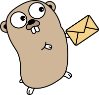

# go-webmail

go-webmail is your personal MDA (mail delivery agent) and webmail interface.

- Receive mails sent to your domain or development machine via SMTP.
- Keep mails on your own private server.
- Access your mails through an encrypted web interface.

Currently in the early stages of development and considered unstable.

- [go-webmail](#go-webmail)
- [Requirements](#requirements)
- [Installation](#installation)
- [Usage](#usage)
    - [Command line options](#command-line-options)
- [Contributing](#contributing)
- [Change log](#change-log)
    - [Unreleased](#unreleased)
    - [1.0.0-alpha - 2016-05-05](#100-alpha---2016-05-05)
- [License](#license)

# Requirements

# Installation
`go get github.com/nochso/go-webmail`

# Usage

## Command line options

# Contributing
Feedback, bug reports and pull requests are always welcome.

Please read the [contributing guide](CONTRIBUTING.md) for instructions.

# Change log
See [CHANGELOG.md](CHANGELOG.md) for the full history of changes between
releases.

## [Unreleased]

### Added
- New option `-V/--version` to show version information and quit.

### Fixed
- Configured log file name was not used.

## [1.0.0-alpha] - 2016-05-05

### Added
- First public release.

[Unreleased]: https://github.com/nochso/go-webmail/compare/1.0.0-alpha...HEAD
[1.0.0-alpha]: https://github.com/nochso/go-webmail/compare/3bff6366de08d8f72d861983eba78034812254d9...1.0.0-alpha

# License
This project is released under the MIT license. See [LICENSE](LICENSE) for the
full text.
